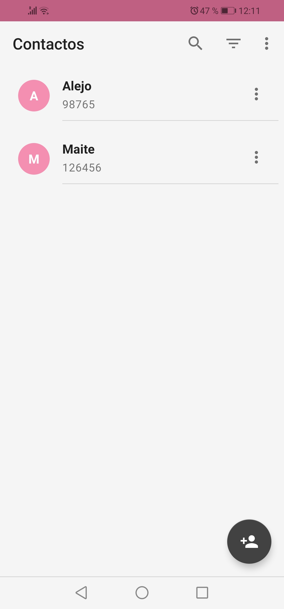
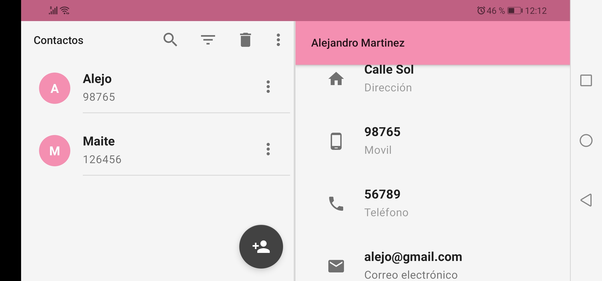

## Description

The contact book is an application developed in Android Studio with Java programming language and SQLite local database, implementing Material Design standards; that allows the user to manage the information of the people who are part of their work and/or social circle.

**Supports and functionalities:**

* CRUD
* Actions in details
* Import/Export contacts
* User search
* Filter by ascending or descending
* Landscape/Portrait
* Responsive
* English and Spanish language

## Author

**Alejandro Martinez**

* [LinkedIn](https://www.linkedin.com/in/diego-alejandro-martinez-espinosa-571086134)

## Screenshots 

## Installation

This project requires to be installed on android mobile devices. 

| Sdk      | Version      |
| :------- | :----------- |
| `min`    | **26**       |
| `target` | **31**       |

## Feedback

If you have any feedback, please reach out to us at dreamstime@outlook.es
